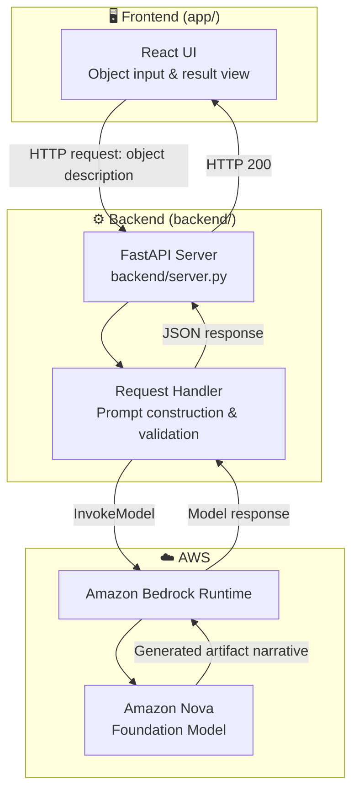
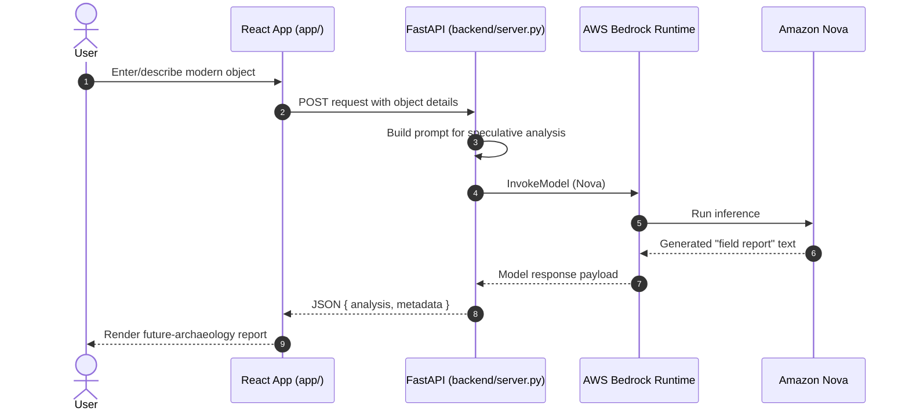

# 🏺 Internet Archaeologist (xenocurator)

> A speculative AI application that analyzes everyday modern objects as if they were artifacts unearthed by a **future archaeologist** — powered by **Amazon Nova** on AWS Bedrock.

<p align="center">
  
  
  
  
  
  
  
  
</p>

---

## 📑 Table of Contents

- [Overview](#-overview)
- [Key Features](#-key-features)
- [Architecture](#-architecture)
- [Request Flow](#-request-flow)
- [Repository Structure](#-repository-structure)
- [Getting Started](#-getting-started)
  - [Prerequisites](#prerequisites)
  - [Backend Setup](#backend-setup)
  - [Frontend Setup](#frontend-setup)
  - [Environment Variables](#environment-variables)
- [Running the App](#-running-the-app)
- [Tech Stack](#-tech-stack)
- [Troubleshooting](#-troubleshooting)
- [Roadmap](#-roadmap)
- [Contributing](#-contributing)

---

## 🌟 Overview

**Internet Archaeologist** reimagines ordinary, present-day objects as relics an archaeologist might dig up thousands of years from now. Upload or describe a modern object, and the app uses **Amazon Nova** (via **AWS Bedrock**) to generate a speculative "field report" — a plausible future-historical interpretation of what the object might mean to a civilization that has forgotten its original purpose.

It pairs a lightweight **React** frontend with a **FastAPI** backend that brokers requests to AWS Bedrock, keeping the AI reasoning entirely server-side.

---

## ✨ Key Features

- 🔎 **Object Analysis** — Submit a modern object and receive an AI-generated speculative artifact interpretation.
- 🧠 **Amazon Nova Reasoning** — Uses AWS Bedrock's Nova foundation model for generative, narrative-style output.
- ⚡ **FastAPI Backend** — Simple, async-ready Python API layer with hot reload (`uvicorn --reload`).
- 🖥️ **React Frontend** — Fast local dev experience via `npm run dev`.
- 🔐 **Server-Side Credentials** — AWS keys stay on the backend; the frontend never touches AWS directly.

---

## 🏛 Architecture



---

## 🔄 Request Flow



---

## 📁 Repository Structure

```text
xenocurator/
├── app/                    # Frontend application (React)
│   └── ...                 # Components, pages, assets
├── backend/                # FastAPI backend
│   └── server.py           # App entrypoint (uvicorn backend.server:app)
├── .gitignore
├── package.json            # Frontend dependencies & scripts
├── requirements.txt        # Backend (Python) dependencies
└── README.md
```

> If `app/` and `backend/` contain additional notable subfolders (e.g. `components/`, `routes/`, `models/`), list them here for future contributors.

---

## 🚀 Getting Started

### Prerequisites

- **Python** 3.10+
- **Node.js** 18+ and **npm**
- An **AWS account** with Bedrock access enabled for **Amazon Nova** in your target region
- AWS credentials (Access Key ID + Secret Access Key) with `bedrock:InvokeModel` permission

### Backend Setup

```bash
git clone https://github.com/Santhosh-p653/xenocurator.git
cd xenocurator

pip install -r requirements.txt

export AWS_ACCESS_KEY_ID="your-key"
export AWS_SECRET_ACCESS_KEY="your-secret"
export AWS_REGION="us-east-1"

uvicorn backend.server:app --reload --port 8000
```

### Frontend Setup

```bash
cd xenocurator
npm install
npm run dev
```

### Environment Variables

| Variable | Required | Description |
| :--- | :--- | :--- |
| `AWS_ACCESS_KEY_ID` | ✅ | IAM access key with Bedrock permissions |
| `AWS_SECRET_ACCESS_KEY` | ✅ | IAM secret key |
| `AWS_REGION` | ✅ | AWS region where Amazon Nova is available (e.g. `us-east-1`) |

> On Windows PowerShell, use `$env:AWS_ACCESS_KEY_ID="your-key"` instead of `export`.

---

## ▶️ Running the App

1. Start the backend: `uvicorn backend.server:app --reload --port 8000`
2. In a separate terminal, start the frontend: `npm run dev`
3. Open the frontend URL printed in your terminal (typically `http://localhost:5173` for Vite-based React apps)
4. Submit an object and view its generated future-artifact report

---

## 🧩 Tech Stack

| Layer | Technology |
| :--- | :--- |
| Frontend | React (via `npm run dev`) |
| Backend | Python, FastAPI, Uvicorn |
| AI Inference | Amazon Nova (AWS Bedrock) |
| Auth to AWS | Environment-variable IAM credentials |

---

## 🛠 Troubleshooting

### `botocore.exceptions.NoCredentialsError`
- **Cause:** AWS credentials not exported in the shell running the backend.
- **Solution:** Re-export `AWS_ACCESS_KEY_ID`, `AWS_SECRET_ACCESS_KEY`, and `AWS_REGION` before starting `uvicorn`.

### `AccessDeniedException` calling Bedrock
- **Cause:** The IAM user/role lacks `bedrock:InvokeModel` permission, or Amazon Nova isn't enabled in that AWS region for your account.
- **Solution:** Enable model access for Amazon Nova in the AWS Bedrock console and attach the required IAM policy.

### Port `8000` already in use
- **Cause:** A previous backend process is still running.
- **Solution:**
  ```bash
  # macOS/Linux
  lsof -ti:8000 | xargs kill -9
  ```
  ```powershell
  # Windows PowerShell
  Get-Process -Id (Get-NetTCPConnection -LocalPort 8000).OwningProcess | Stop-Process
  ```

### Frontend can't reach backend (CORS / connection refused)
- **Cause:** Backend not running, or frontend is pointing at the wrong API base URL.
- **Solution:** Confirm the backend is live at `http://localhost:8000` and check the frontend's API base URL configuration.

---

## 🗺 Roadmap

- [ ] Add image upload support for object analysis (not just text description)
- [ ] Persist generated reports
- [ ] Add unit/integration tests for backend endpoints
- [ ] Deploy guide for AWS (Lambda/ECS + Amplify or S3/CloudFront)

---

## 🤝 Contributing

Issues and pull requests are welcome. Fork the repo, create a feature branch, and submit a PR describing your changes.
